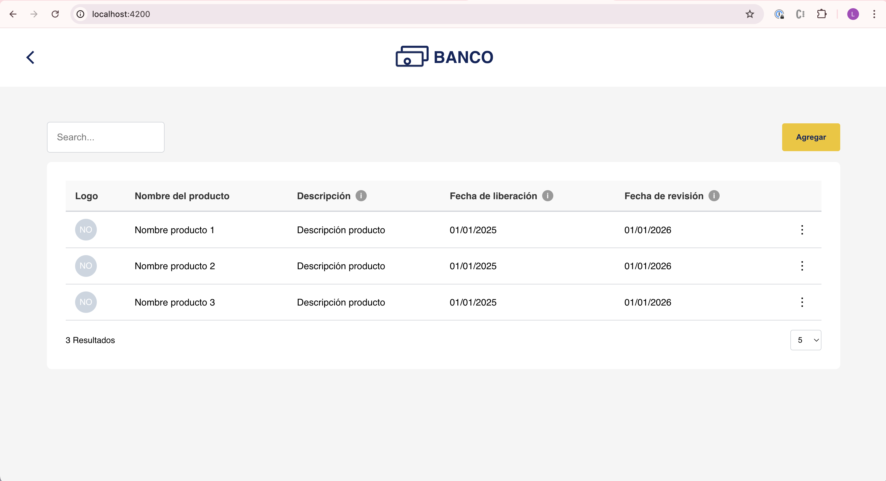
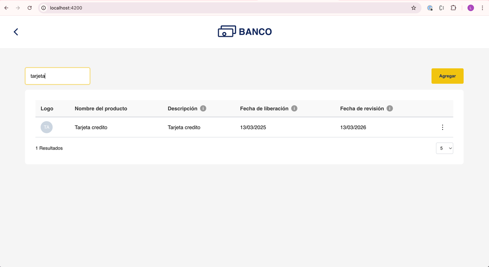
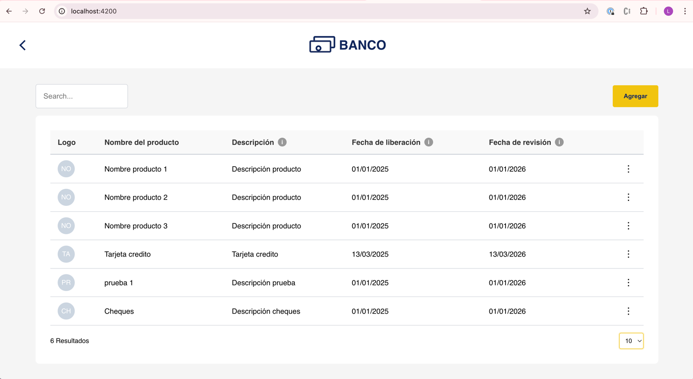
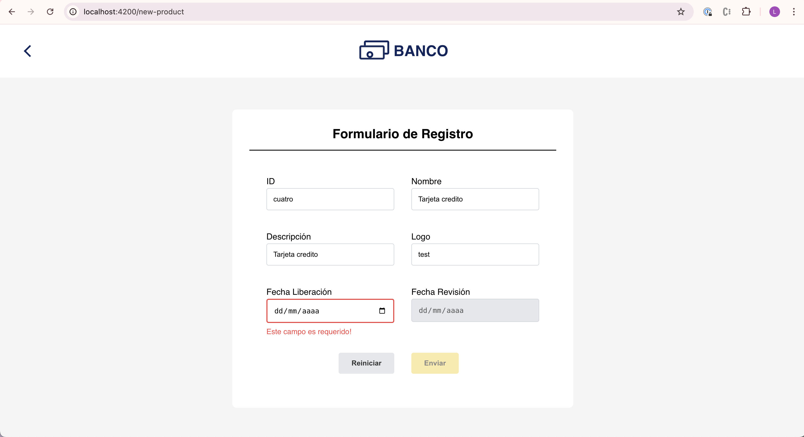
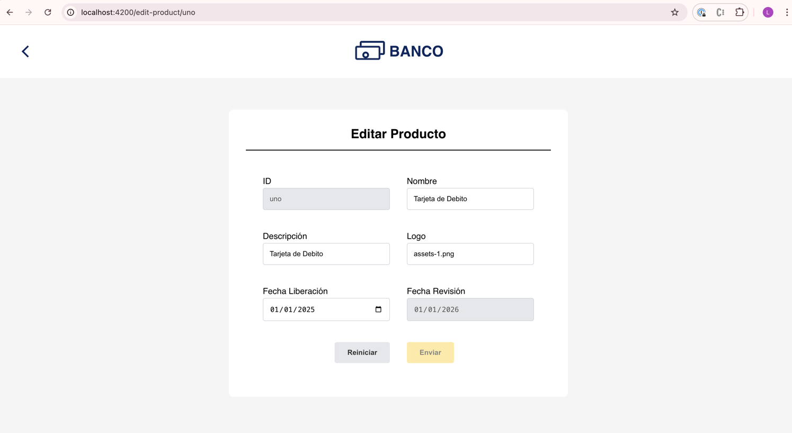
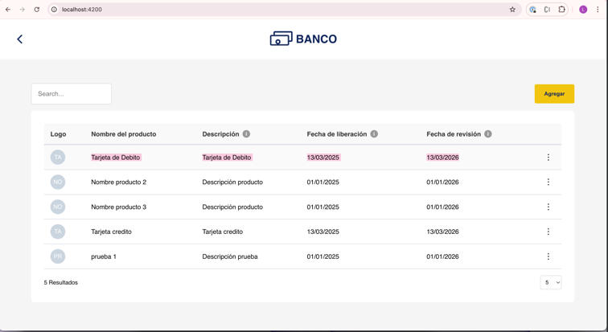
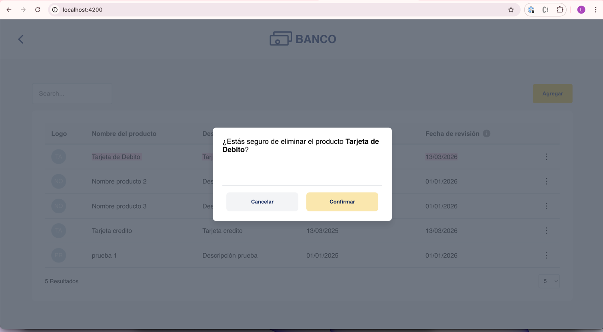

# FinancialProducts

This project was generated with [Angular CLI](https://github.com/angular/angular-cli) version 18.2.12.

## Development server

Run `ng serve` for a dev server. Navigate to `http://localhost:4200/`. The application will automatically reload if you change any of the source files.

# F1. Listado de productos financieros:

# F2. búsqueda de productos financieros: 

# F3. Cantidad de registros:

# F4. Agregar producto:

# F5. Editar producto:

# F5 (EDITADO). Editar producto:

# F6. Eliminar producto:

